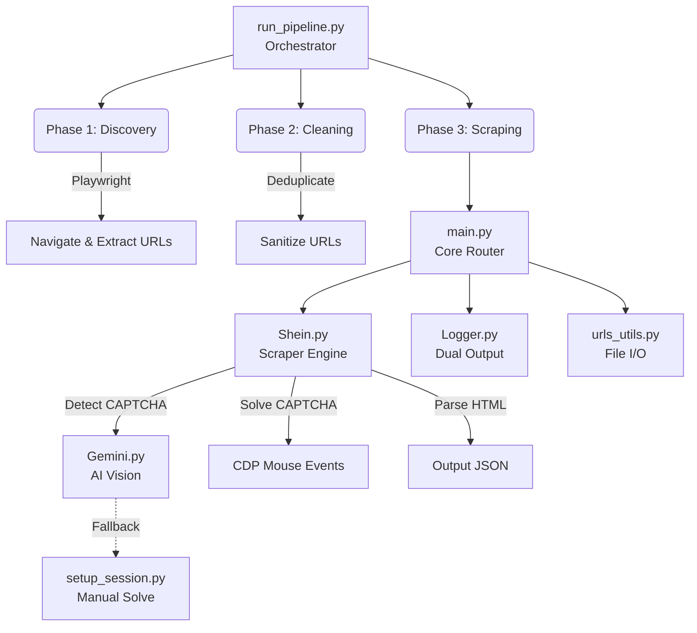
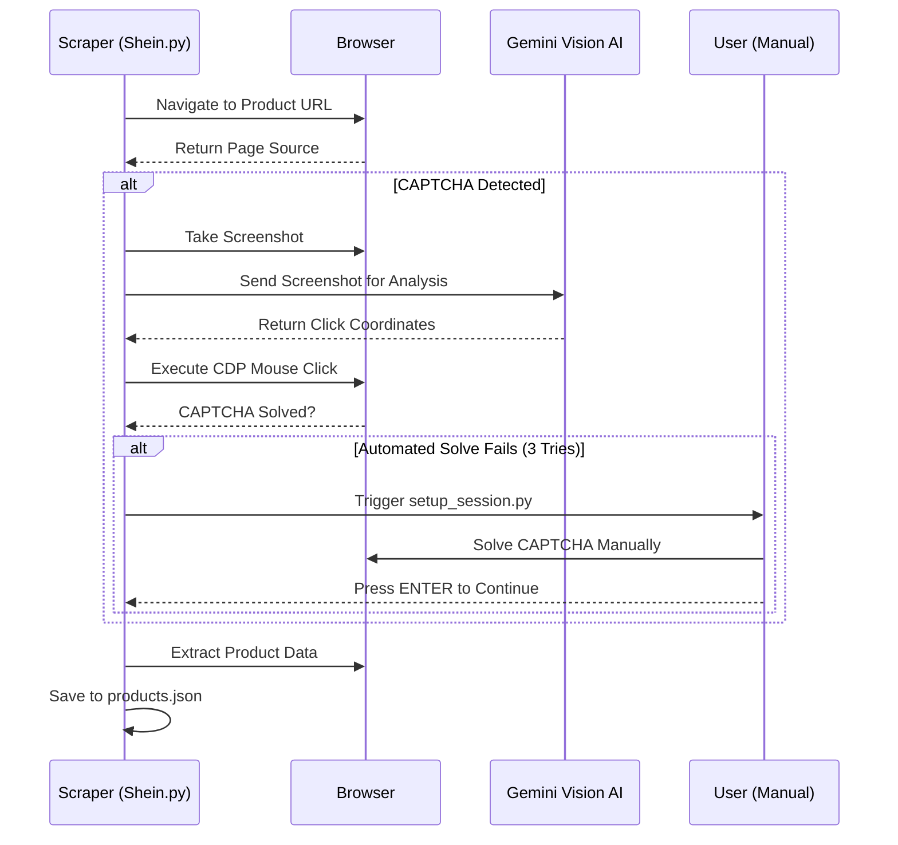

# Shein Web Scraper

A production-ready web scraper for extracting product information from **Shein**, featuring an automated 3-phase pipeline, AI-powered CAPTCHA solving, and incremental data saving.

---

## Features

- **End-to-End Pipeline** — Fully automated 3-phase workflow: URL Discovery → URL Cleaning → Mass Scraping
- **Anti-Bot Evasion** — Uses `undetected-chromedriver` with persistent Chrome profiles and human-like mouse movements
- **AI-Powered CAPTCHA Solving** — Google Gemini Vision detects and solves CAPTCHAs automatically via CDP clicks
- **Smart Session Management** — Manual CAPTCHA refresh is triggered only when a CAPTCHA is actually detected (no arbitrary pauses)
- **Incremental Saving** — Products are saved to `Outputs/products.json` after each successful scrape, so no data is lost on interruption
- **Duplicate Detection** — Already-scraped URLs are automatically skipped on subsequent runs
- **AI Marketing Content** — Optional Gemini-powered marketing text generation for scraped products

## Architecture



## Requirements

- **Python** >= 3.8
- **Chrome Browser** (for `undetected-chromedriver`)
- **Google Gemini API Key** (for CAPTCHA solving and optional marketing content)

## Installation

```bash
# Clone the repository
git clone https://github.com/BrenoFariasdaSilva/E-Commerces-WebScraper.git
cd E-Commerces-WebScraper

# Create and activate virtual environment
python -m venv venv
# Windows:
venv\Scripts\activate
# macOS/Linux:
source venv/bin/activate

# Install dependencies
pip install -r requirements.txt

# Install Playwright browsers
playwright install chromium

# Install undetected-chromedriver
pip install undetected-chromedriver
```

## Configuration

1. Copy `.env.example` to `.env`:
   ```bash
   cp .env.example .env
   ```

2. Add your Gemini API key(s):
   ```
   GEMINI_API_KEY=Main:AIza...your_key_here
   ```
   Multiple keys can be comma-separated for automatic failover:
   ```
   GEMINI_API_KEY=Main:AIza...key1,Backup:AIza...key2
   ```

## Usage

### Full Pipeline (Recommended)

```bash
python run_pipeline.py
```

This runs all 3 phases automatically:
1. **Discovery** — Navigates category pages and collects product URLs into `Inputs/urls.txt`
2. **Cleaning** — Deduplicates and sanitizes the URL list
3. **Session Warmup** — Opens a browser for you to solve the initial CAPTCHA manually
4. **Scraping** — Processes each URL, saving results to `Outputs/products.json`

### Options

```bash
python run_pipeline.py --target 500        # Limit to 500 URLs
python run_pipeline.py --out custom.txt    # Use a custom URL file
```

### Single URL Testing

```bash
python test_scraper.py
```

### Direct Scraping (Skip Discovery)

```bash
python main.py --target 100
```

## Output

All scraped data is saved to `Outputs/products.json` as a JSON array. Each product contains:

```json
{
  "url": "https://us.shein.com/...",
  "name": "Product Name",
  "sku": "sz260...",
  "reviews": "4.8",
  "available_sizes": ["S", "M", "L", "XL"],
  "current_price_integer": "28",
  "current_price_decimal": "98",
  "old_price_integer": "49",
  "old_price_decimal": "11",
  "discount_percentage": "41%",
  "description": "..."
}
```

## File Structure

```
├── .env.example          # Environment variable template
├── .gitignore            # Git ignore rules
├── Gemini.py             # Google Gemini AI integration
├── Inputs/
│   └── urls.txt          # Product URLs (auto-populated by Phase 1)
├── LICENSE               # AGPL-3.0 license
├── Logger.py             # Dual-output logger (terminal + file)
├── Logs/                 # Runtime log files
├── Outputs/
│   └── products.json     # Scraped product data
├── README.md             # This file
├── Shein.py              # Shein platform scraper
├── main.py               # Core execution engine
├── product_utils.py      # Product name normalization
├── requirements.txt      # Python dependencies
├── run_pipeline.py       # End-to-end orchestrator
├── setup_session.py      # Manual CAPTCHA session helper
├── test_scraper.py       # Single-URL test script
├── urls_input_file_adder.py  # Utility to add URLs to input file
└── urls_utils.py         # URL loading and preprocessing
```

## How CAPTCHA Handling Works




---

## 📈 Scaling & Evaluation Notes

This section directly addresses common scaling requirements and challenges, specifically the goal of scaling this scraper to **10,000 products** from SHEIN US.

### 🔗 Resources
- **GitHub Repository**: [(https://github.com/aks-hit/E-comm-web-scrapper.)]
- **Sample Output**: See [`Outputs/sample_output.json`](Outputs/sample_output.json) for a sample of the scraped data schema.

### 🚀 Approach for Scaling to 10,000 Products

While the current architecture is robust for hundreds of products, scaling to 10,000 requires moving from a sequential, local-first approach to a distributed architecture:

1. **Distributed Task Queue:** Replace the simple loop in `main.py` with a robust message broker like Celery + Redis or RabbitMQ. This allows multiple worker nodes (running the scraper) to pull URLs concurrently.
2. **Database Storage:** The current `products.json` file strategy is not safe for high-concurrency writes. The output should be piped directly into a database (e.g., PostgreSQL or MongoDB) which handles concurrent connections gracefully and allows tracking the status (Pending/Success/Failed) of each URL.
3. **Headless Execution & Resource Limits:** `undetected-chromedriver` is highly memory-intensive. For 10k products, workers must run in fully headless mode (`HEADLESS=True`) across a scalable cloud infrastructure (e.g., Kubernetes or AWS ECS) to handle the memory overhead of multiple concurrent browser instances.
4. **Proxy Pool & Rotation:** SHEIN employs aggressive rate-limiting. A rotating residential proxy network is mandatory to distribute the requests across different IP addresses, preventing mass IP bans.
5. **Phase Isolation:** Phase 1 (Discovery) is relatively lightweight, while Phase 3 (Scraping) is heavy. Scaling involves decoupling these phases so that a single discovery node can feed thousands of URLs to a fleet of scraping nodes.

### ⚠️ Limitations, Challenges, and Assumptions

#### Challenges Faced
- **Aggressive Anti-Bot Mechanisms:** SHEIN uses sophisticated fingerprinting (Turnstile/Cloudflare) and complex CAPTCHAs (image grids and slide puzzles). Traditional Selenium/Playwright tools are immediately blocked. This necessitated integrating **Google Gemini Vision API** to visually "read" the CAPTCHA and use **Chrome DevTools Protocol (CDP)** for low-level, human-like mouse clicks.
- **Dynamic DOM Changes:** The CSS selectors for product information (price, SKU, sizes) are occasionally randomized or obfuscated, requiring constant maintenance of the parsing logic in `Shein.py`.
- **Latency Overheads:** Using an LLM (Gemini) for CAPTCHA solving introduces a ~5-15 second latency per challenge, creating a bottleneck if CAPTCHAs are triggered frequently.

#### Current Limitations
- **Memory Usage:** The scraper relies on launching a full Chrome instance. Running more than 4-5 concurrent scrapers on a standard consumer laptop will likely cause Out-Of-Memory (OOM) errors.
- **Dependency on Manual Fallback:** If the AI solver fails 3 times, the pipeline correctly falls back to a manual session (`setup_session.py`). While this guarantees data extraction, it prevents true "unattended" execution 100% of the time if bot-protection gets highly aggressive.

#### Key Assumptions
- **DOM Stability:** The script assumes the core structural classes (like the product description layout) remain relatively consistent.
- **US Region Format:** The scraping logic (like currency parsing) assumes the `us.shein.com` English format.
- **Network Stability:** The script assumes a stable internet connection capable of handling concurrent downloads for high-res product images.
